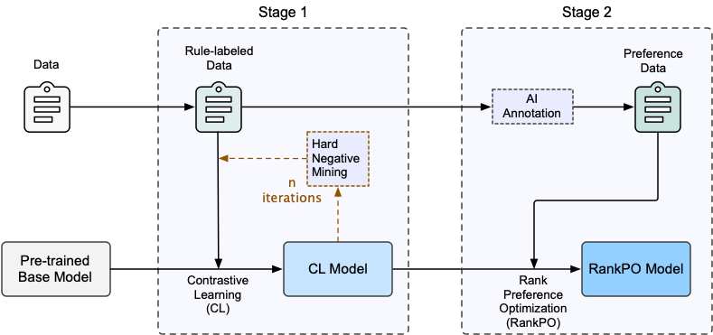
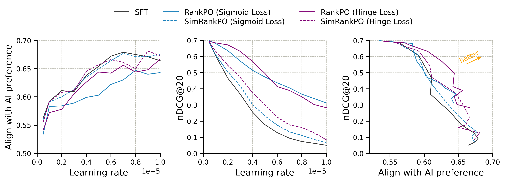

# RankPO: Rank Preference Optimization

This repository contains the code and data for the paper: [RankPO: Preference Optimization for Job-Talent Matching](https://arxiv.org/abs/2503.10723).

It implements a two-stage framework for aligning language models with human/AI preferences while retaining previously learned knowledge:
* Stage 1: Contrastive learning
* Stage 2: Rank Preference Optimization (RankPO)


<p align="center">
  
</p>

<br>

<p align="center">
  
</p>


## 📂 Repository Structure

### 1. Main Components

#### 1.1 `src/`: Contains the core python codes to train and evaluate models.

- **Contrastive Learning**: 
  - `modeling.py`: Defines the core model operations such as `forward` passes and inference mode.
  - `contrastive_trainer.py`: Custom trainer leveraging Hugging Face's `Trainer` for contrastive learning.
  - `run_contrastive.py`: Script to train models using contrastive learning with rule-based data generation.

- **Rank Preference Optimization (RankPO)**:
  - `rankpo_trainer.py`: Custom trainer for RankPO, implementing specialized training objectives.
  - `run_rankpo.py`: Script to train models using RankPO for preference alignment.


#### 1.2 Scripts:
  - `scripts/`: Bash commands to train/evaluate the models.


### 2. Supportive Files

- **Arguments**:
  - `arguments.py`: Defines training, data, and model arguments for both stages.

- **Utilities**:
  - `data_uitls.py`: Defines data processing and collators.
  - `utils.py`: Contains FAISS search and compute metric blocks.
  - `evaluate.py`: Evaluate the model in terms of MRR/Recall/nDCG.
  - `get_random_negatives.py/get_hard_negatives.py`: Get random/hard negatives.

- **Configs**:
  - `configs/`: Directory for configuration files for deepspeed.


## 🚀 **Usage**

### **1. Contrastive Learning**

The first stage uses **contrastive learning** with rule-based data generation to train models on limited data. This step builds robust and generalizable ranking capabilities.

Run the contrastive learning stage with:

```bash
bash scripts/train/run_contrastive.sh
```

Or specifically,

```bash
# HF_HOME=/xxx/xxx/.cache/huggingface \
torchrun \
    --nnodes=1 \
    --nproc-per-node 4 \
    --master-port=29500 \
src/run_contrastive.py \
    --model_name_or_path <model-name-or-path> \
    --attn_implementation flash_attention_2 \
    --train_data <path-to-train-data> \
    --token <your-hf-token> \ # to download restricted models
    --output_dir <output-directory> \
    --learning_rate 1e-5 \
    --lr_scheduler_type cosine \
    --warmup_ratio 0.1 \
    --bf16 \
    --gradient_checkpointing \
    --deepspeed configs/ds_zero1_config_llama.json \
    --num_train_epochs 3 \
    --per_device_train_batch_size 8 \
    --gradient_accumulation_steps 4 \
    --num_negatives 5 \
    --use_inbatch_neg \
    --negatives_cross_device \
    --dataloader_drop_last True \
    --normalize_embeddings True \
    --temperature 0.02 \
    --max_query_length 1280 \
    --max_passage_length 4096 \
    --logging_steps 1 \
    --log_level info \
    --save_strategy epoch \
    --save_only_model \
    --remove_unused_columns False \
    --wandb_project contrastive \
    --run_name <wand-run-name> \
```

> [!NOTE]
> May change the arguments accordingly.<br>
> For example:
> * To download `meta-llama/Llama-3.2-1B` from huggingface hub, you should specify huggingface token:<br>
> `--token <your-hf-token>`
> * Set `HF_HOME=/xxx/xxx/.cache/huggingface` environ if you want the model to be downloaded to directory:
> `/xxx/xxx/.cache/huggingface/hub`


### **2. Rank Preference Optimization (RankPO)**

The second stage fine-tunes the model to align with AI preferences using RankPO.

Run the RankPO stage with:

```bash
bash scripts/train/run_rankpo.sh
```

Or specifically,

```bash
torchrun \
    --nnodes=1 \
    --nproc-per-node 1 \
    --master-port=29500 \
src/run_rankpo.py \
    --model_name_or_path <model-name-or-path> \
    --attn_implementation flash_attention_2 \
    --train_data <path-to-train-data> \
    --output_dir <output-directory> \
    --lr_scheduler_type cosine \
    --warmup_ratio 0.1 \
    --bf16 \
    --gradient_checkpointing \
    --deepspeed configs/ds_zero1_config_llama.json \
    --num_train_epochs 3 \
    --per_device_train_batch_size 8 \
    --gradient_accumulation_steps 4 \
    --overwrite_output_dir True \
    --dataloader_drop_last True \
    --normalize_embeddings True \
    --max_query_length 1280 \
    --max_passage_length 4096 \
    --logging_steps 1 \
    --dataset_num_proc 8 \
    --reference_free True \
    --disable_dropout False \
    --sft_weight 0.0 \
    --rankpo_weight 1.0 \
    --learning_rate 1e-5 \
    --temperature 0.1 \
    --beta 2.0 \
    --loss_type sigmoid \
    --log_level info \
    --save_strategy epoch \
    --save_only_model \
    --remove_unused_columns False \
    --wandb_project rankpo \
    --run_name <wand-run-name> \
```


## ⚙️ Install Requirements

**CUDA Version**: This repository requires CUDA 11.8 to ensure compatibility with the provided code and dependencies. Other versions may also work.

The `requirements.txt` file contains the full list of dependencies, which was generated from the environment used during development. 
However, you **do not** need to install all of them. 
Instead, installing the core dependencies should be sufficient to run the project. 
Below is a list of the core dependencies you need to install:

```bash
torch==2.4.1
deepspeed==0.15.2
transformers==4.45.2
datasets==3.0.1
accelerate==1.0.1
trl==0.11.0
flash-attn==2.7.3   # pip install flash-attn --no-build-isolation
```

> We recommend to install pyTorch by:<br>
> https://pytorch.org/get-started/previous-versions/#linux-and-windows-4
> 
> ```bash
> # CUDA 11.8
> conda install pytorch==2.4.1 torchvision==0.19.1 > torchaudio==2.4.1  pytorch-cuda=11.8 -c pytorch -c nvidia
> ```

For other missing packages, please refer to the `requirements.txt` file.


## 📄 Example Data Format

### **Contrastive Learning Data**
```json
{
  "query": "Example query",
  "positives": ["Positive sample 1", "Positive sample 2"],
  "negatives": ["Negative sample 1", "Negative sample 2"]
}
```

### **RankPO Data**
```json
{
  "query": "Example query",
  "passage1": "Passage for comparison A",
  "passage2": "Passage for comparison B",
  "preferred": "A"  # or "B"
}
```


## 🎓 Citation
If you find the repo helpful for your work, please consider to cite our paper:

```
@misc{zhang2025rankpo,
      title={RankPO: Preference Optimization for Job-Talent Matching}, 
      author={Yafei Zhang and Murray Wang and Yu Wang and Xiaohui Wang},
      year={2025},
      eprint={2503.10723},
      archivePrefix={arXiv},
      primaryClass={cs.CL},
      url={https://arxiv.org/abs/2503.10723}, 
}
```

## 🤝 Contributing

Contributions are welcome! If you have suggestions, feature requests, or bug fixes, please open an issue or submit a pull request.

## 📜 License

This project is licensed under the Apache 2.0 License. See the [LICENSE](LICENSE) file for more details.

